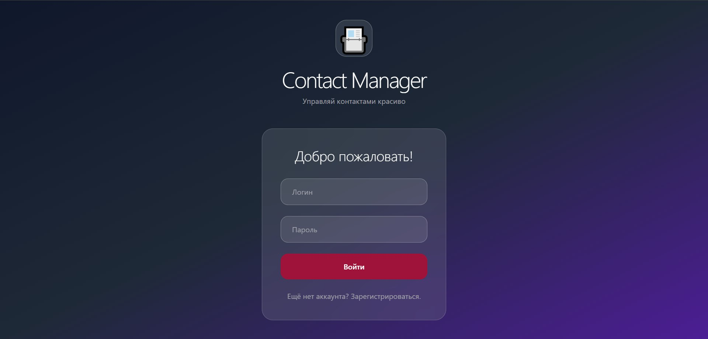
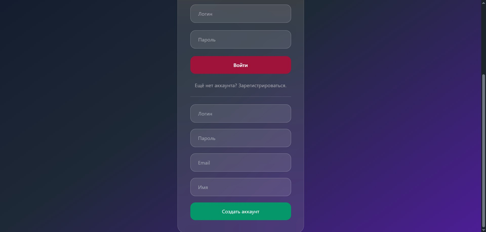
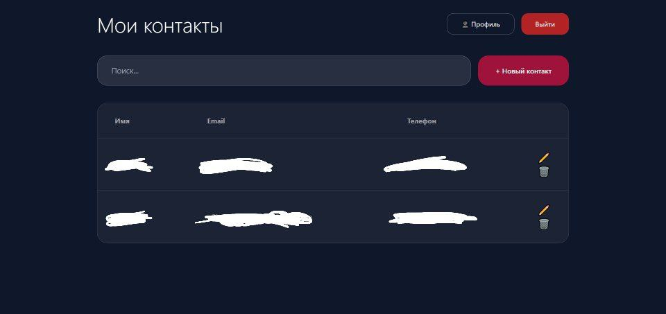
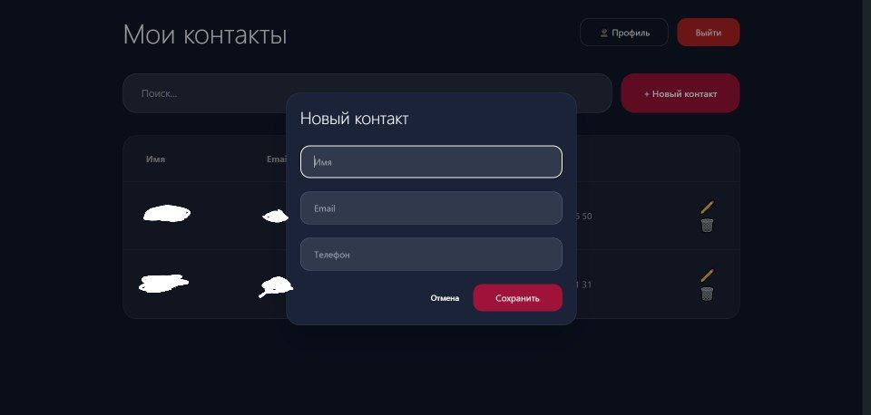
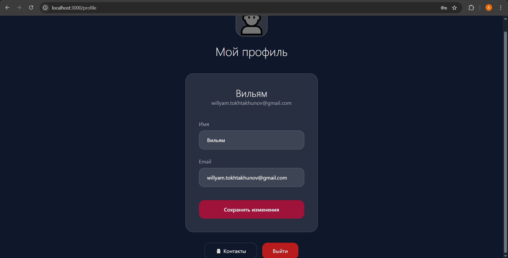

# Contact Manager

Полноценное веб-приложение для управления контактами.

# Функции

Регистрация / авторизация (JWT)
CRUD контактов + поиск
Редактирование профиля
Красивый тёмный интерфейс







## Стек
- Frontend: Vue 3 + Vite + Tailwind CSS + DaisyUI (тёмный дизайн)
- Backend: Go + Gin + GORM
- База: PostgreSQL
- Всё в Docker Compose

## Запуск

```bash
docker compose up --build